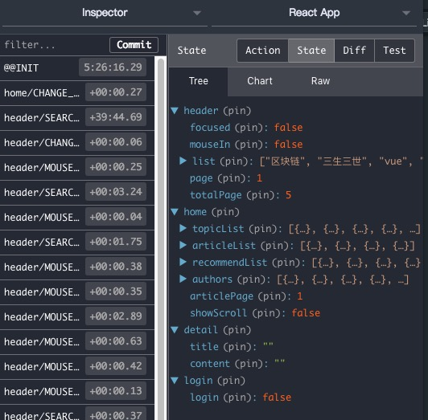

# React-全家桶仿简书部分功能

### [前言](_)

> 前段时间接触了下React，一直想要自己写一个小Demo练手。在众多应用中，考虑之后选择了简书来模仿，这段时间就利用了工作之余的时间进行开发。主要用到了React+React-Router4+Redux+Redux-thunk+Immutable。然而写文章也是可以复盘一下自己的开发过程，对自己还是受益良多的。在这里简单叙述一下我仿简书部分布局以及功能实现的过程，仅做学习用途。

### `技术栈以及组件库`

* Redux：解决组件数据共享问题
* Redux-thunk：Redux中间件，允许action可以返回函数
* Immutable：保证数据的不可变
* Loadable：异步加载组件
* Transition-group：动画实现
* styled-components：组件化样式
* axios： 这个大家都知道吧-_-

**数据结构：**



### `文件结构`
```
┣━ build   // 打包文件
┣━ public   // 打包文件
  ┣━ api   //假数据统一存储
    ┣━ detail.json   //文章页数据
    ┣━ headerList.json   //头部热门搜索数据
    ┣━ home.json   //首页统一数据
    ┣━ homeList.json   //首页加载更多文章数据
    ┣━ login.json   //登录数据
┣━ src //开发目录
  ┣━ common   //公用组件
    ┣━ header   //头部组件
      ┣━ store   //Redux文件
        ┣━ actionCreators.js   //action创建
        ┣━ constants.js   //action.type常量文件
        ┣━ index.js   //入口文件
        ┣━ reducer.js   //reducer处理
      ┣━ store   //UI组件
      ┣━ store   //头部样式
  ┣━ pages   //页面
    ┣━ detail   //文章页
      ┣━ ...
    ┣━ detail   //首页
      ┣━ ...
    ┣━ detail   //登录页
      ┣━ ...
    ┣━ detail   //写文章
      ┣━ ...
  ┣━ statics   //静态文件
    ┣━ ...
  ┣━ store   //Redux数据
    ┣━ ...
  ┣━ App.js   //入口及路由
  ┣━ index.js   //js文件入口
  ┣━ style.js   //全局样式
┣━ .gitignore   //git忽略上传文件
┣━ package.json   //模块的描述文件
┣━ README.md   //说明文件
┣━ yarn.lock   //模块的描述文件
```

### `效果预览`


### `实现主要几个功能`

* **登录退出及未登录拦截**

用户在已登录状态和未登录状态的界面是不同的，有些功能指定要在登录状态下才会有，因此会产生状态的切换，在一般小项目中我们可以使用`localStorage`来存储状态，也可以用Redux，这里我所有的数据都是使用Redux进行数据管理，在进入写文章页面调用了login组件下Redux-login状态进行判断,登录拦截。

```
class Write extends PureComponent {
  render() {
    const { loginStatus } = this.props;
    console.log(loginStatus)
    if(loginStatus) {
      return (
        <div>写文章</div>
      )
    }else{
      return <Redirect to="/login" />
    }
  }
  componentDidMount() {
  }
}

const mapState = (state) => ({
  loginStatus: state.getIn(['login','login'])
});
```

* **点击加载更多文章**

这里在Redux中储存一个Page：1的数据，在每次点击加载更多文章时page+1,然后对page进行改变。使得每次点击page+1。

* **头部热门搜索获取及切换**

在Home组件获取到数据后储存到Redux中,然后取出前十条数据，储存到常量中。通过点击事件对数据进行切换,同时出发动画效果。(由于使用了`immutable`,所以要在循环的数据前将数据转换为不同JS数组)
```
const { focused, list, page, mouseIn, totalPage, handleMouseEnter, handleMouseLeave, hanleChangePage } = this.props;
    const newList = list.toJS();  //因为list目前是immutable数组,所以我们要将他转换为普通JS数组,toJS是immutable内置方法
    const pageList = [];

    if(newList.length){
      for(let i = (page -1) * 10; i < page * 10; i++){
        pageList.push(
          <SearchInfoItem key={newList[i]}>{newList[i]}</SearchInfoItem>
        )
      }
    }

    if(focused || mouseIn) {
      return (
        <SearchInfo
          onMouseEnter={handleMouseEnter}
          onMouseLeave={handleMouseLeave}
        >
          <SearchInfoTitle>
            热门搜索
            <SearchInfoSwitch onClick={() => hanleChangePage(page,totalPage,this.spitIcon)}>
              <i ref={(icon) => {this.spitIcon = icon}} className="iconfont spin">&#xe6bb;</i>
              换一批
            </SearchInfoSwitch>
          </SearchInfoTitle>
          <SearchInfoList>
            {pageList}
          </SearchInfoList>
        </SearchInfo>
      )
    }else {
      return null;
    }
  }
```

* **文章页数据**

文章页数据的获取使用的`动态路由`，通过路由传参将当前所点击文章的ID传递到文章页。
* 同时也可以通过this.props.location.search 获取url参数。
* 这里注意由于使用了异步组件，路由的文件引入路径要做修改`import Detail from './pages/detail/loadable';`，不然获取不到路由所传递的参数。
```
class Detail extends PureComponent {
//dangerouslySetInnerHTML是当数据内容是HTML时使用,不会被转义为字符串
  render() {
    const { title, content } = this.props;
    return (
      <DetailWrapper>
        <Header>{title}</Header>
        <Content
          dangerouslySetInnerHTML={{__html: content}}
        />
      </DetailWrapper>
    )
  }

  componentDidMount() {
    let idPage = this.props.location.search;
    const id = idPage.substring(4)
    this.props.getDetail(id);
    //使用动态路由获取idthis.props.getDetail(this.props.match.params.id);
  }
}
```

### `结语`

> 由于工作比较忙,所以只做了一些基础的小功能。后面还有很多有待完善，等空余时间多了出来回慢慢进行完善。由于刚接触React,所以做的不太好，不足之处还请指教。

> 如果你初次接触到React，或者对Demo感兴趣的话可以查看我[GitHub](https://github.com/Ghost-Luu/React-JianShu)源码

> 如果对你有帮助，可以star我的项目给我一点点的鼓励，也希望有志同道和的可以加入一起讨论，我也会第一时间帮你解答。
